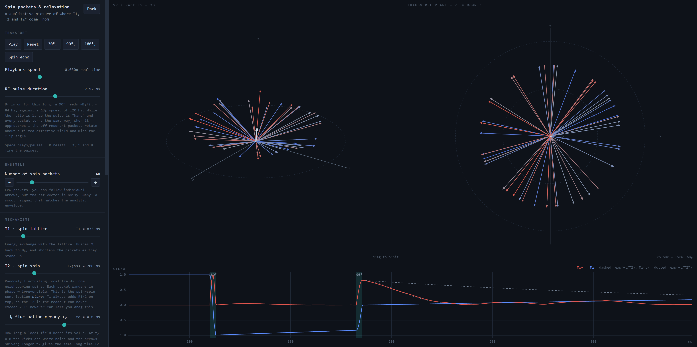
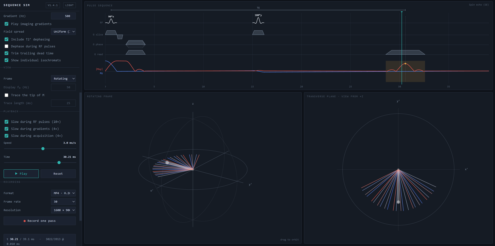
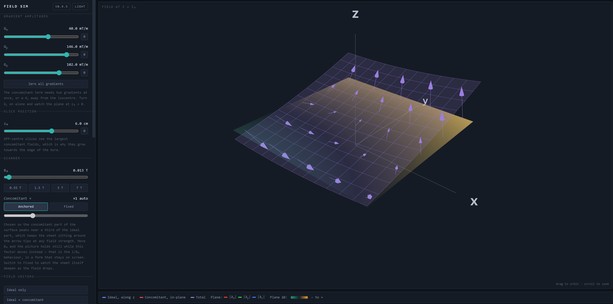
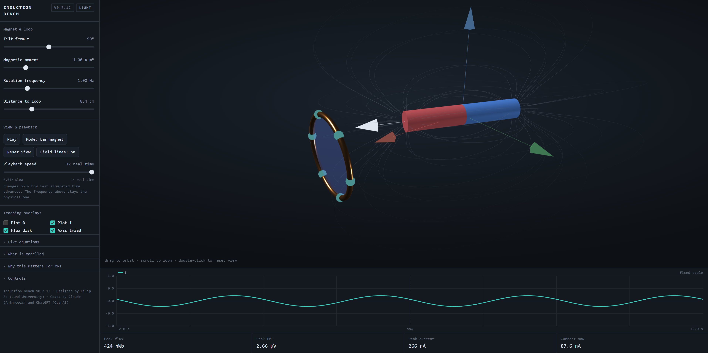
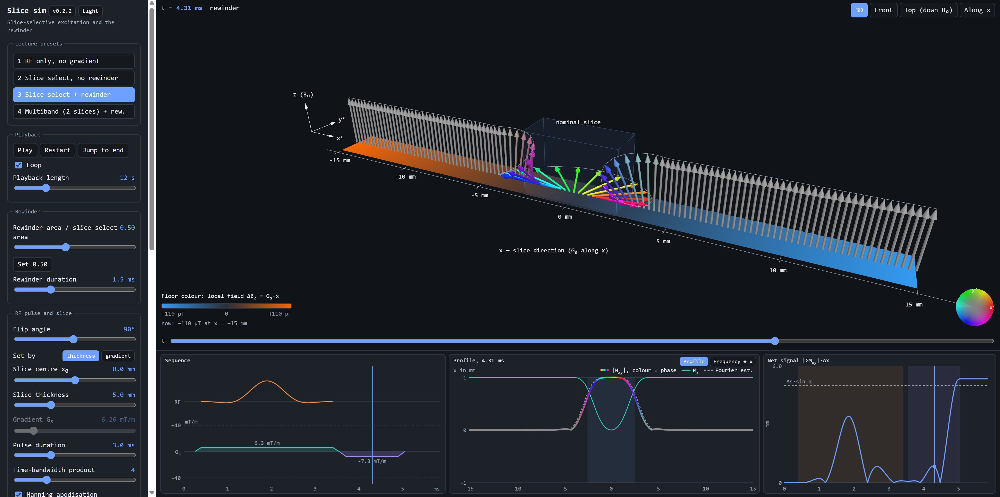
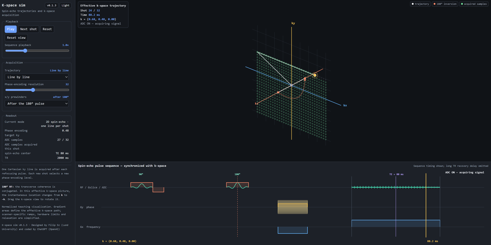

# MRI simulators for visualization
Designed by Filip Sz (Lund University) and coded by Claude (Anthropic) and ChatGPT (OpenAI).

Six interactive MRI physics visualisations. Each is a single self-contained HTML
file with no build step, no server and no network access, and should run well on
both PCs and phones. The 3D views use WebGL, with Three.js bundled inside the
file.

All six share one look: the simulator name in capitals at the top left of the
control rail, a version chip and a light/dark chip at the right of the same line,
a one-line description underneath, and uppercase section headings below that. The
light/dark choice is shared between the files and remembered, and follows the
operating-system setting on a first visit.

**These are teaching aids, not quantitative simulators.** They are meant for
showing the basic ideas and for making figures and clips, not for predicting
signal or reproducing measurements. The models are deliberately simplified. Each
simulator states its own simplifications under the version chip in its header,
which also opens the credits and changelog. Typical simplifications are a single
voxel, one spatial axis, no diffusion or flow, and approximate relaxation values
that are not corrected for field strength.

| Simulator | Topic |
|---|---|
| [`mriRelaxSim.html`](#mrirelaxsimhtml--relaxation-sim) | T1, T2 and T2\* relaxation |
| [`mriSeqSim.html`](#mriseqsimhtml--sequence-sim) | Bloch simulation of common sequences |
| [`mriFieldSim.html`](#mrifieldsimhtml--field-sim) | Gradient and concomitant (Maxwell) fields |
| [`mriInductSim.html`](#mriinductsimhtml--induction-sim) | Signal induction in a receive coil |
| [`mriSliceSim.html`](#mrislicesimhtml--slice-sim) | Slice-selective excitation and the rewinder |
| [`mriReadoutSim.html`](#mrireadoutsimhtml--k-space-sim) | K-space trajectories in spin-echo imaging |

## How to use

The simulators must be downloaded and opened in a local browser. Clicking an
`.html` file here on GitHub only shows its source code; it does not run it.

1. Download one simulator, or all of them:
   - **One file:** click the file in the list above the README, then use the
     *Download raw file* button (↓) at the top right of the code view.
   - **All files:** click the green **Code** button and choose **Download ZIP**,
     then unzip. Or clone the repo:
     `git clone https://github.com/filip-szczepankiewicz/mriSimGraphical.git`
2. Open the downloaded `.html` file in a browser, for example by double-clicking
   it or dragging it into a browser window.

No installation, server or internet connection is needed; everything runs
inside the file. A recent version of Chrome, Edge, Firefox or Safari is
recommended. Video recording in the Sequence sim and Field sim relies on the
WebCodecs API, which is best supported in Chromium-based browsers (Chrome, Edge).

On a phone, save the file to the device and open it from the file manager in a
browser. Some mobile file viewers show the source instead of running the page.

## `mriRelaxSim.html` — Relaxation sim

Where T1, T2 and T2\* come from. An isochromat ensemble driven by three separate
mechanisms — T1 relaxation, spin–spin fluctuation with a correlation time, and a
static ΔB₀ spread — shown as a 3D view, a transverse plane and a signal plot with
analytic envelopes. Hard or finite-duration RF pulses, and a spin-echo demo.

## `mriSeqSim.html` — Sequence sim

Bloch-equation spin dynamics for seven sequences (FID, saturation recovery, spin
echo, CPMG, spoiled GRE, IR-SE, bSSFP) plus a nutation demo, with a tissue
library including two-compartment mixtures, STIR/FLAIR nulling, and slow motion
at RF pulses, gradients and acquisition. Records a full pass as a video.

## `mriFieldSim.html` — Field sim

3D view of the ideal gradient field and the concomitant (Maxwell) terms that come
with it: gradients to 200 mT/m, B₀ from 0.01 to 20 T, an optional ΔB surface, and
gradient modulation during capture. Orbit, wiggle or still recording for slides.
The concomitant field itself is computed from the closed-form expression.

## `mriInductSim.html` — Induction sim

A rotating/precessing magnetic dipole beside a pickup coil, showing magnetic flux,
Faraday induction, induced current, flip-angle dependence and distance falloff.
The display can switch between a classical bar-magnet view and a spin-½ density-
operator view. In spin mode the density operator is visualised as an exaggerated
projective-measurement probability surface: an unpolarised state is spherical,
while increasing illustrative polarisation produces a rotating pear-shaped surface,
coloured red toward surplus probability and blue toward deficit probability. The
live 2×2 density matrix is shown alongside the 3D view.

## `mriSliceSim.html` — Slice sim

Slice-selective excitation, and why the rewinder is needed. A row of spins along
the slice direction is driven by a sinc RF pulse (adjustable time-bandwidth
product, optional Hanning apodisation) played during a trapezoidal slice-select
gradient Gs. The floor under the spins is coloured by the local field
ΔBz = Gs·x. The resulting |Mxy| profile is
coloured by transverse phase, so the phase dispersion before the rewinder and the
coherent slice after it can be seen directly, with a Fourier (small-tip) estimate
for comparison. A second panel maps the RF spectrum onto position through
f = γ̄Gsx to show how bandwidth and gradient set the slice thickness.

Four lecture presets step through the argument: RF without a gradient, slice
selection without a rewinder, slice selection with a rewinder, and a two-slice
multiband pulse. Flip angle, slice thickness or gradient, slice offset, pulse
duration, rewinder area and rewinder duration are adjustable. The model uses the
rotating-frame Bloch equation without relaxation or off-resonance.

## `mriReadoutSim.html` — K-space sim

The effective k-space trajectory of a spin-echo acquisition, drawn in 3D and kept
in sync with an RF/gradient/ADC sequence diagram. Acquired samples accumulate on
the k-space grid shot by shot, and the 180° pulse is shown as the k → −k
mapping of the transverse coherence. The x/y prewinders can be placed before or
after the refocusing pulse to show how that changes the path.

Seven acquisition modes: line-by-line Cartesian, single-shot EPI, single-shot
spiral, segmented spiral, multi-echo spin echo (three echoes per shot), and two
segmented Cartesian schemes. Phase-encoding resolution is adjustable. Gradient
areas define the path; ramps, hardware limits and relaxation are simplified.

## Licence

The simulators are released under the MIT License (see [`LICENSE`](LICENSE)).
See [`NOTICE`](NOTICE) for attribution, the use of AI-assisted development, and
the bundled third-party software.
